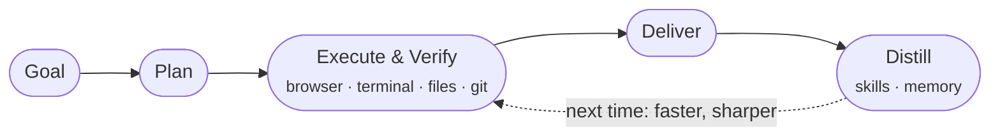

<h1 align="center">EvoForge</h1>

<p align="center">
  <strong>Most AI agents start every day from zero.<br>EvoForge remembers everything it learned yesterday.</strong>
</p>

<p align="center">
  
  
  
  
  
</p>

<p align="center">
  <a href="#-download">Download</a> ·
  <a href="#-why-its-different">Why it's different</a> ·
  <a href="#-a-real-workbench">A real workbench</a> ·
  <a href="#-connect-your-stack">Connections</a> ·
  <a href="#-security--privacy">Security & privacy</a> ·
  <a href="#-feedback">Feedback</a>
</p>

---

> This repository hosts EvoForge releases, changelogs, and issue tracking. EvoForge is not an open-source project; nothing in this repository grants an open-source license.

## ⚡ Why it's different

Every agent you've tried has the same flaws: teach it something today, and tomorrow it's gone. It can run commands, but files, terminal, browser, and Git live in five different places. And you don't dare leave the screen during a long task, because you don't know what it might delete.

**EvoForge's answer is a loop, not a chat box:**



After every task, EvoForge **reflects on the run**: action sequences worth repeating are distilled into **skills**, your preferences and project context are written into **memory**, and a built-in **curator** periodically merges, dedupes, and prunes what accumulates — so it doesn't bloat with use, it sharpens. The next time a similar task shows up, it reaches for the skill it already earned and skips every pit it already fell into.

```text
$ "ship the landing page"

  ▸ plan       3 steps, 2 tools required
  ✓ browse     collected 14 sources
  ✓ terminal   build passed, 42 tests green
  ✓ files      wrote src/landing/…  (+412 −0)
  ✦ distilled  new skill: deploy-preview-flow
  ● memory     noted: you prefer pnpm
```

## 🛠 A real workbench

Not "a chat box with tools" — everything a worker needs, in one window:

|  |  |
|---|---|
| 🌐 **Browser** | Embedded browser panel — the agent scrapes, clicks, and live-casts the page back to you |
| 💻 **Terminal** | Real shell execution; on Windows, encoding and error streams are handled automatically, output stays clean |
| 📁 **Files & Git** | Read/write the workspace, generate patches, commit branches, open GitHub PRs directly |
| 🎯 **Goal mode** | Hand over a long-running goal; it plans, executes, and verifies autonomously within a token budget you set |
| 🧠 **Memory & skill panels** | Everything it accumulates is visible, editable, deletable — you audit its "experience" |
| 🔍 **Full-text search** | Every past session is searchable; yesterday's conclusions don't need re-deriving |

## 🔌 Connect your stack

**The big three, one click each.** GitHub, Cloudflare, and Supabase connect through their official CLIs with browser authorization — click, log in, done. More importantly, **the agent knows what you've connected**. With Supabase linked, ask it to "add an index to this table" and it just does it — no more *"I don't have database access."*

**The long tail, through MCP.** Any MCP server — stdio or remote HTTP — works by pasting its config. Servers that require OAuth (Notion, Linear, Sentry, Supabase MCP, and most official remote servers) connect with a single **Authorize** click: discovery, client registration, and PKCE are fully automatic; tokens persist and refresh on their own.

## 🎨 Looks matter too

| Style | Character |
|-------|-----------|
| **Cold Gray** | The Linear-inspired default — cool, precise, quiet |
| **Paper** | Warm ink-on-paper, low glare, easy on long sessions |
| **Mist** | Nordic blue-gray, calm and atmospheric |
| **Graphite** | Pure high-contrast monochrome, true-black dark mode for OLED |

Four complete interface styles × five accent colors × light/dark = **40 combinations**, every one calibrated for contrast, switchable live from Settings. And the UI speaks **six languages**: English (default), 简体中文, 日本語, 한국어, Deutsch, Français.

## 🔒 Security & privacy

**Everything stays on your machine.** API keys, conversations, memories, and skills live locally in `~/.evoforge`. Nothing leaves except the calls to the model provider you configured.

**Execution has boundaries.** Three sandbox levels (read-only / workspace-write / full access), mandatory confirmation for destructive operations, hard refusal of dangerous command patterns, and an audit trail for everything it runs. Hand it a long task and go make coffee.

## 📦 Download

Grab the latest version from [GitHub Releases](../../releases):

| Platform | Download |
|----------|----------|
| Windows | `.exe` installer |
| macOS | `.dmg` image |

After installing, `Help → Check for Updates` keeps you current.

## 🚀 Three steps in

1. **Pick a model** — choose a provider and paste an API key on the launch page (or hit *Set up later* and look around first)
2. **Give it work** — from "organize this folder" to "write tests for this repo and open a PR"
3. **Watch it evolve** — after a few tasks, open the Skills panel and see what it has learned

## 💬 Feedback

Found a bug or want a feature? Open an [Issue](../../issues) — attaching relevant output from the **Logs** panel makes diagnosis much faster.

---

<p align="center">
  <sub>EvoForge © 2026 · Non-commercial license · Evolution against forgetting</sub>
</p>
